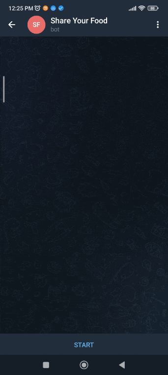
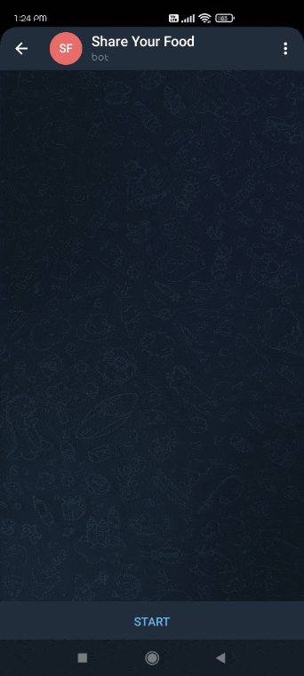

# WHAT IS SHAREYOURFOOD?
---

ShareYourFood is a Telegram bot. You can reach out to the bot at https://t.me/ShareYourFoodBot.

---

# WHY DID YOU CREATE THIS BOT?
---

Every year approximately 1.3 billion tonnes of food gets lost or wasted [[Source](https://www.unep.org/thinkeatsave/get-informed/worldwide-food-waste)].

As such I have created this bot in an attempt to lower this large amount of food waste.

---

# HOW DOES IT WORK?
---

If you have any food / edibles that you are going to throw out anyways, how about sharing it with others? Maybe there is someone who needs it more than you.

This is how it goes:

1. You tell `ShareYourFoodBot` that you have some food to share.
2. `ShareYourFoodBot` accepts your request and saves a few of your details in it's database.
3. Now, if someone is need of food, he / she will raise a request to `ShareYourFoodBot`. Someone who is in need of food can be of two categories:
    - The requestor himself is in need of food.
    - The requestor is near someone (like homeless people) who is need of food.
4. `ShareYourFoodBot` will search if anyone near the requestor is sharing food.
5. If it finds someone, it will share the details of those people with the requestor so that, he / she can be contacted.

---

# GIVE US A DEMO
---

- `/share`

    

- `/request`

    

---

# PRIVACY
---

The following data will be saved in `ShareYourFoodBot`'s database. This data is saved **FOR A MAXIMUM OF 5 HOURS** (considering the fact that food items may become stale after 5 hours):

1. Your **fullname** (Publicly available through Telegram API when a user contacts the bot).
2. Your **username** (Publicly available through Telegram API when a user contacts the bot).
3. Your **chat id** (Publicly available through Telegram API when a user contacts the bot)
4. Your **message id**. (Publicly available through Telegram API when a user contacts the bot).
5. Your **location** (This is requested from user because the bot will try to find people near you. It doesn't really make sense if a user is sharing food from New York and another user is requesting food from Texas).

---

# LICENSE
---

This is a free and open-source bot released under MIT License.